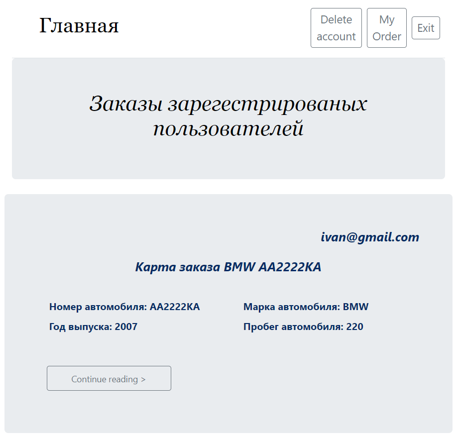
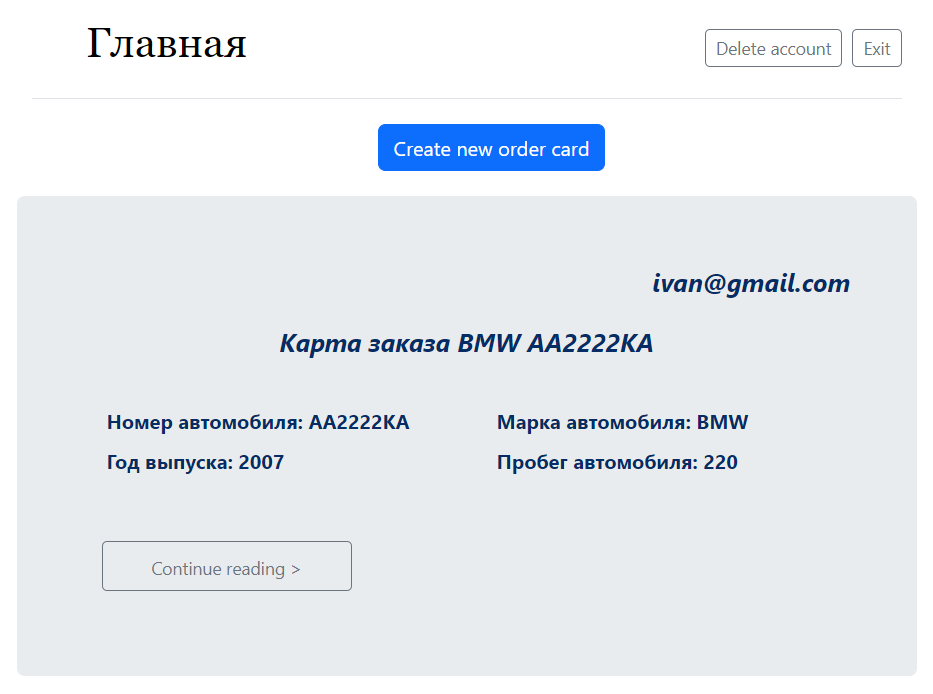

Web application on the theme of Service Stations.

The project is created as a blog where registered users can create an order card.

The cards consist of information about the car, breakdowns, repair cost, the name and surname of the mechanic who deals with the repair and the status of the order.

When entering the main page before authorization, users see all user orders that have already been completed.

Authorized users see all order cards, on the My Order tab, the user can create, view, edit and delete their cards. When you delete a user, the system automatically deletes all order cards that do not have the completed status.

To start working with the project, you need to install the PostgreSQL DBMS from the official site: https://www.postgresql.org/download/ Create a database of data. 
Next, you need to replace the password and database name in the main.py file
"postgresql://postgres:[your password]@localhost:5432/[your db name]"

Run the application, all the necessary tables will be created automatically. Master pages are initially empty due to lack of information in the tables. All information can be set at your discretion, adjusted for restrictions.

Input data limits:  
Email must contain the "@" symbol, the maximum length is 120 characters  
All first and last names are limited to 50 characters  
The password is limited to 8 characters  
A car number of 8 characters   
The brand of the car is 150 characters  
Price >=0.01  
Mileage >=0 
Year >=1900